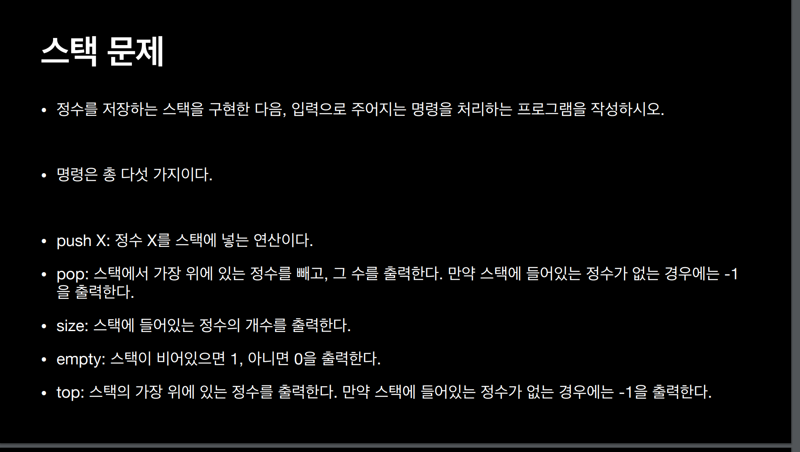
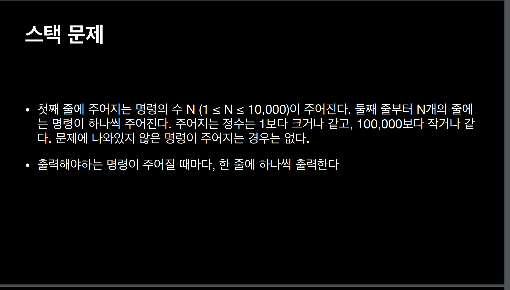

# Stack 스택 문제
> 정수를 저장하는 스택을 구현한 다음, 입력으로 주어지는 명령을 처리하는 프로그램을 작성하시오

> Stack 구현 문제

- 왜 self.size를 사용해야 하나?
    - 클래스 안에 있는 값들을 클래스에 종속된 함수만 접근할 수 있게 함으로써 독립성을 유지하는 객체지향적 방법
    - 항상 객체를 생성해야 하는 이유

- 리스트의 크기를 지정하지 않아도 되는 이유?
    - 원래 파이썬도 C로 만들어 졌기 때문에 정확하게 공간 지정을 해야한다.
    - 메모리를 사용하는 방식을 파이썬이 조정하는 것. (ex: 이사)
    - 리스트를 선언할 때 우리 눈에 빈 리스트처럼 보여도 시스템단에서 NN개 공간을 미리 잡아둔 상태가 된다. 그리고 그 범위를 넘어가면 값들을 좀 더 큰 배열에 재할당 한다.
    - `append`도 내부적으로 보면 추가할 `값`과 `인덱스`를 알 때 값을 할당 하는 작업이다.
    - `self.stack_list += [int(num)]` 처럼 한다고 하면 연산 횟수가 많아질 때 그만큼 연산을 해야하므로 `append`보다 시간복잡도가 N^2 정도로 커진다.

- 스택의 크기는 마지막 위치 값을 알리는 지표 역할을 한다.

- 메모리를 해제하는 작업도 비용이기 때문에 메모리를 불러올 때 이전에 있던 값이 있더라도 그대로 불러온다. 메모리를 불러오는 작업이 보통 덮어씌우는 작업이기 때문이다.