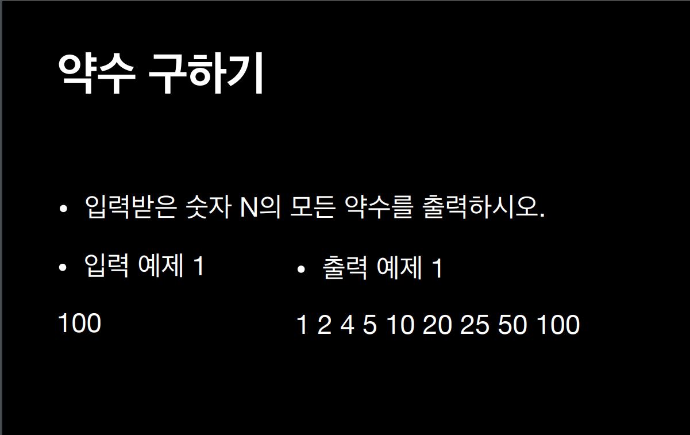

# 약수 구하기



## Solution 1

### idea
약수의 **정의**를 구현
- 약수 : 1이상 N이하 의 수 중에서 나눴을 때 나누어지는 수

### Code
```python
num = int(input())
divisor_list = []
for i in range(1, num+1):
    if num%i == 0:
        divisor_list.append(i)
    
print(divisor_list)
```

## Solution 2

### idea
약수의 **특성**을 이용하는 방법
- 약수에는 짝이 있다. 약수의 중심을 찾는 방법
- ex) 1 * 100, 2 * 50, 4 * 25, 5 * 20, 10 * 10

### Code
```python
# import math

num = int(input())
# sqrt_num = int(math.sqrt(num))
sqrt_num = int(num ** (1/2))    # "범위 생성자에 대해 인자는 정수여야 합니다"(공식문서)

front_divisor_list = []
rear_divisor_list = []

for i in range(1, sqrt_num+1):
    if num % i == 0:
        front_divisor_list.append(i)
        if i != int(num/i):
            reat_divisor_list.append(num/i)
    print(front_divisor_list + rear_divisor_list[::-1])
```

