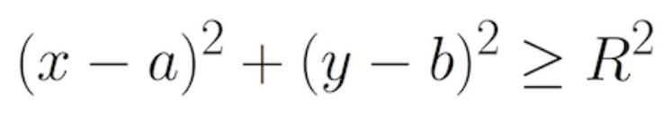

# 휴식을 위하여

> 단순 구현 문제

### 문제 설명
- 소음의 진원지 좌표와 반경 반지름을 주었을 때 이후의 입력값이 소음의 진원지 근방에 존재하는지 확인한다.
- 사용 식  
    


## Solution
### idea
- `split()`
    - split 은 인자로 아무것도 넣지 않았을 때 공백문자를 기준으로 문자열을 나누는데, 이 때 공백문자는 단순 띄어쓰기 `' '`만 포함하는 것이 아닌 줄 개행문자 `\n`, 들여쓰기 `\t` 등을 포함한다.
    - 단, 결과값이 `str type` 이므로 수 연산시 데이터 형변환을 잊지 말아야 한다.
- `map`
    - iterable한 map 객체를 반환한다.
    - 하단의 용례 말고도 다양하게 사용된다.


### code 
```python
def check_sound_status(a, b, r, x, y)
    if (x-a)**2 + (y-b)**2 >= r**2:
        return "silent"
    return "noisy"

a, b, r = map(int, input().split())
n = int(input())

for _ in ragne(n):  # for문의 변수가 불필요한 경우 _ 을 사용
    x, y = map(int, input().split())
    print(check_sound_status(a, b, r, x, y))
```