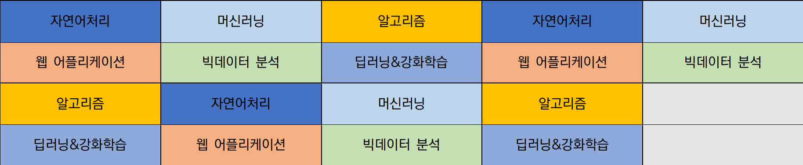

<h1 align=center>Rotation Course</h1>

광주인공지능사관학교 / 중고급과정

 

 

### [Web Application](https://github.com/4923/GwangjuAI2/tree/master/02_Rotation/WebApplication)
Web Full Stack (HTML/CSS/JS, Django, Docker, AWS)

### [Algorithm](https://github.com/4923/GwangjuAI2/tree/master/02_Rotation/Algorithm)
Python Data Structure, Algorithm

### [DeepLearning & Reinforcement Learning](https://github.com/4923/GwangjuAI2/tree/master/02_Rotation/DeepLearning)
Tensorflow

### [MachineLearning : Unsupervised Learning](https://github.com/4923/GwangjuAI2/tree/master/02_Rotation/MachineLearning)
Tensorflow

### [BigData Analysis](https://github.com/4923/GwangjuAI2/tree/master/02_Rotation/BigData)
Statistics, SQL

### [NLP](https://github.com/4923/GwangjuAI2/tree/master/02_Rotation/NLP)
Natural Language Processing

### [Mentoring/Seminar](https://github.com/4923/GwangjuAI2/tree/master/02_Rotation/Mentoring)