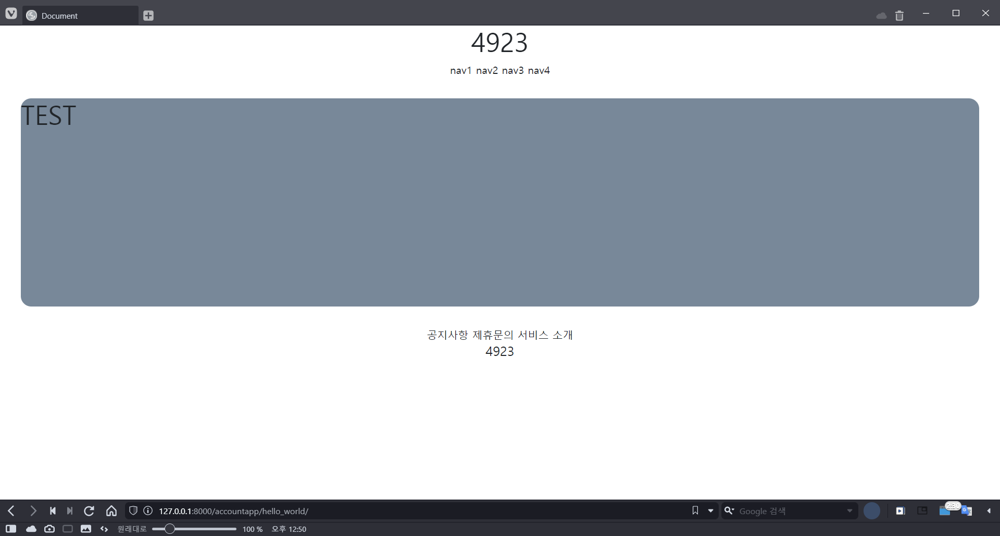

> bootstrap과 google font를 활용한다.

### bootstrap
1. bootstrap?
    - twitter가 발표한 front-end library 
    - css를 일일이 만지지 않아도, class만 지정하면 디자인을 사용할 수 있다.
    - 버튼, 알림 팝업, 카드 레이아웃, 내비게이션 바 등 다양한 **디자인 요소**들을 긁어올 수 있다.
    - 소스를 사용하여 페이지 디자인을 개선시킬 수 있다.

2. 적용방법
    1. bootstrap 검색
        - 공식페이지 [link](https://getbootstrap.com)
        - 공식문서 [documnets](https://getbootstrap.com/docs/5.0/getting-started/introduction/)
    2. 공식 문서의 css 복사
        ```css
        <link href="https://cdn.jsdelivr.net/npm/bootstrap@5.0.2/dist/css/bootstrap.min.css" rel="stylesheet" integrity="sha384-EVSTQN3/azprG1Anm3QDgpJLIm9Nao0Yz1ztcQTwFspd3yD65VohhpuuCOmLASjC" crossorigin="anonymous">
        ```
    3. 프로젝트에 적용
        - 외부 소스를 가져오는 위치는 head이므로 head에 불러온다.
        ```html
        <!-- templates/head.html -->
             bootstrap link 
            <link href="https://cdn.jsdelivr.net/npm/bootstrap@5.0.2/dist/css/bootstrap.min.css" 
                rel="stylesheet"
                integrity="sha384-EVSTQN3/azprG1Anm3QDgpJLIm9Nao0Yz1ztcQTwFspd3yD65VohhpuuCOmLASjC" 
                crossorigin="anonymous">
        ```
    4. 변경사항 확인
        - 레이아웃이 소소하게 변경되었다.
        - 